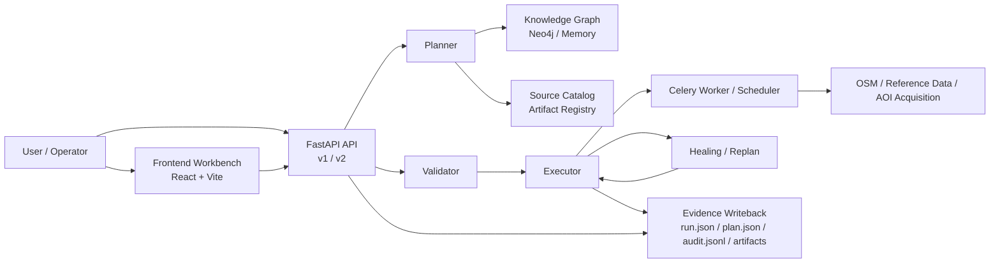

<div align="center">

# FusionAgent

<p><strong>面向有界灾害响应场景的地理空间矢量数据融合智能体运行时</strong></p>

<p>
  <a href="https://github.com/plutoqz/FusionAgent/stargazers"></a>
  
  
  
  
  
</p>

<p>
  
  
  
  
</p>

<p>
  <a href="./README.en.md">English README</a> ·
  <a href="./docs/v2-operations.md">运行文档</a> ·
  <a href="./docs/local-direct-run.md">本机直跑</a> ·
  <a href="./docs/demo/fusionagent-resume-project-brief.md">Resume / Demo Brief</a>
</p>

</div>

---

## 导航

- [项目简介](#项目简介)
- [核心亮点](#核心亮点)
- [能力边界](#能力边界)
- [系统架构](#系统架构)
- [任务与证据模型](#任务与证据模型)
- [技术栈](#技术栈)
- [仓库结构](#仓库结构)
- [快速开始](#快速开始)
- [本地部署方案](#本地部署方案)
- [API 概览](#api-概览)
- [测试与验证](#测试与验证)
- [当前限制](#当前限制)
- [参考文档](#参考文档)

## 项目简介

FusionAgent 是一个面向有界灾害响应场景的地理空间矢量数据融合智能体运行时。仓库内同时包含：

- 后端运行时与 API
- 知识图谱约束层
- 任务与场景编排链路
- 输入准备、artifact reuse 与证据写回
- 面向 operator 的 Web 工作台

它的目标不是成为一个无边界通用 Agent，而是在明确任务范围内，把**任务理解、数据获取、约束规划、融合执行、失败修复、证据沉淀**组织成一个可测试、可审计、可复现实验的工程系统。

> 当前定位更接近“有界、可验证、可回归的地理空间 Agent Runtime”，而不是最终产品化平台。

## 核心亮点

| 维度 | 当前实现 |
| --- | --- |
| 任务范围 | `building`、`road`、`water`、有界 `poi` |
| 运行入口 | 上传输入 / `task_driven_auto` / scenario run |
| 运行模式 | `planner -> validator -> executor -> healing/replan -> writeback` |
| KG 后端 | `Neo4j` 或 `memory` |
| 执行链路 | FastAPI + Celery + Redis |
| 前端能力 | run 列表、详情、对比、KG 概览、场景文档、LLM 设置 |
| 证据输出 | `run.json`、`plan.json`、`validation.json`、`audit.jsonl`、artifact bundle |
| 适用形态 | 研究原型、工程 MVP、本地复现实验环境 |

### 你可以把它理解成

- 一个可运行的 geospatial fusion agent backend
- 一个受知识图谱与策略约束的 task/scenario runtime
- 一个带有 operator 控制面的实验与验证平台

## 能力边界

### 当前适用

- 有明确任务类型和输出目标的灾害响应矢量融合
- 需要保留 planning / validation / execution / evidence 链路的研究原型
- 需要在本地环境重复跑通单次 run、场景 run 和回归验证的项目

### 当前不宣称

- 开放域通用 Agent
- 完整生产级多租户平台
- 最终产品级前端与可视化体验
- 场景层面的 live event-feed 编排或 full digital twin 模拟
- 任意数据源自动接入与任意任务族无限扩展

当前 system-next 收敛重点已经锁定为 `registered tool contracts`、`KG grounding reports`、`unsupported-intent rejection`、token/latency telemetry、`checkpoint recovery inspection` 与 ablation evidence。这些增强项服务于现有有界 runtime 的可验证性与可操作性，不扩张稳定能力边界。

## 系统架构



### 运行时主链

1. `planner` 根据任务、场景、知识图谱和 source catalog 生成候选方案
2. `validator` 对计划、参数、输入约束和能力边界做校验
3. `executor` 调度具体融合算法与输入准备过程
4. `healing / replan` 在失败或约束不满足时执行有限修复
5. `writeback` 持久化状态、计划、审计日志、artifact 和场景证据

## 任务与证据模型

### 支持的任务

| 任务 | 状态 | 说明 |
| --- | --- | --- |
| `building` | 稳定支持 | 支持上传输入与 `task_driven_auto` |
| `road` | 稳定支持 | 支持共享 runtime backbone |
| `water` | 稳定支持 | 已接入 shared runtime backbone |
| `poi` | 有界支持 | 当前范围刻意收敛，不宣称通用实体对齐 |

### 输入模式

| 模式 | 说明 |
| --- | --- |
| uploaded | 显式上传 `osm.zip` / `ref.zip` |
| `task_driven_auto` | 基于 query、AOI、source catalog 自动准备输入 |
| scenario run | 单次场景请求驱动多个子 run 与报告生成；边界限定在 `building` / `road` / `water` / 有界 `poi` 编排，不承诺 live event-feed 或 digital twin 输出 |

### 单次 run 证据契约

```text
run.json
plan.json
validation.json
audit.jsonl
artifact bundle
```

### scenario run 额外证据

```text
scenario_summary.json
kg_path_trace.json
workflow_trace.json
source_coverage.json
evaluation.json
documents/scenario_report.zh.md
documents/scenario_report.en.md
```

## 技术栈

### 后端与运行时

- `FastAPI`
- `Pydantic`
- `Celery`
- `Redis`
- `Neo4j`

### GIS 与数据计算

- `GeoPandas`
- `Shapely`
- `Fiona`
- `PyProj`
- `Rasterio`
- `NetworkX`
- `SciPy`
- `NumPy`
- `Pandas`

### 前端工作台

- `React 18`
- `Vite`
- `TypeScript`
- `React Router`
- `TanStack Query`
- `MapLibre GL`
- `Cytoscape`

## 仓库结构

```text
fusionAgent/
├─ agent/                 # planner / executor / retriever 等运行时核心
├─ api/                   # FastAPI 应用与路由
├─ frontend/              # React + Vite operator 工作台
├─ kg/                    # 知识图谱构建、查询与 bootstrap
├─ services/              # 运行编排、场景服务、设置服务、预览服务
├─ schemas/               # Pydantic schema 与响应模型
├─ scripts/               # 本地启动、冒烟、评测、证据冻结等脚本
├─ tests/                 # 单元测试、集成测试、golden cases
├─ docs/                  # 运行文档、计划、规格与说明
├─ worker/                # Celery app 与后台任务
├─ Data/                  # 本地原始数据与参考数据目录
└─ runs/                  # 本地运行产物与日志输出目录
```

## 快速开始

### 1. 准备 Python 环境

```powershell
python -m venv .venv
.venv\Scripts\Activate.ps1
python -m pip install -r requirements.txt
```

### 2. 准备前端依赖

```powershell
Set-Location frontend
npm install
Set-Location ..
```

### 3. 初始化本机配置

```powershell
Copy-Item 依赖.txt.example 依赖.txt
```

仓库提供两类配置入口：

- [依赖.txt.example](./依赖.txt.example)：本机 Redis、Neo4j、LLM 等私有依赖模板
- [.env.example](./.env.example)：环境变量示例

### 4. 启动一个最小可用环境

```powershell
$env:GEOFUSION_KG_BACKEND='memory'
$env:GEOFUSION_LLM_PROVIDER='mock'
$env:GEOFUSION_CELERY_EAGER='1'
uvicorn main:app --host 127.0.0.1 --port 8000
```

再启动前端开发服务器：

```powershell
Set-Location frontend
npm run dev
```

## 本地部署方案

### 方案 A：快速模式

适用于接口联调、前端开发、单元测试和轻量冒烟。

```powershell
$env:GEOFUSION_KG_BACKEND='memory'
$env:GEOFUSION_LLM_PROVIDER='mock'
$env:GEOFUSION_CELERY_EAGER='1'
uvicorn main:app --host 127.0.0.1 --port 8000
```

特点：

- 不依赖 Neo4j / Redis 全链路
- 适合日常开发与 API/页面联调
- 默认前端开发地址为 `http://127.0.0.1:5173`

### 方案 B：本地全链路模式

适用于 Redis、Neo4j、worker、scheduler 和真实 LLM 都参与的联调。

先检查依赖和 Neo4j bootstrap：

```powershell
python scripts/start_local.py --check-only
```

通过检查后启动：

```powershell
python scripts/start_local.py --port 8000
```

默认行为：

- API 启动在 `http://127.0.0.1:8000`
- 日志输出到 `runs/local-runtime/`
- 自动启动 API、worker、scheduler
- 当 KG 后端为 `neo4j` 时自动完成本地 seed 检查与 bootstrap
- 启动摘要会打印当前 `Neo4j database` 与 `Neo4j namespace guard`

推荐的 Neo4j 隔离顺序：

1. 每个项目独立 Neo4j 实例或独立端口
2. 保持 `GEOFUSION_GRAPH_NAMESPACE=fusionagent` 作为应用级二次防护
3. 不要把论文证据 run 放进一个杂糅共享图视图里

### 方案 C：前后端同源托管

当 `frontend/dist/` 存在时，FastAPI 会自动托管构建后的前端静态资源。

```powershell
Set-Location frontend
npm run build
Set-Location ..
uvicorn main:app --host 127.0.0.1 --port 8000
```

### 方案 D：Docker Compose

```powershell
docker compose up --build
```

默认会启动：

- `api`
- `worker`
- `scheduler`
- `redis`
- `neo4j`

默认端口：

- API: `8000`
- Redis: `6379`
- Neo4j HTTP: `7474`
- Neo4j Bolt: `7687`

> 容器模式默认使用 `redis://redis:6379/0` 与 `bolt://neo4j:7687`，和本机 `依赖.txt` 方案是两套独立约定。

## API 概览

### Run 相关

- `GET /api/v2/runs`
- `POST /api/v2/runs`
- `GET /api/v2/runs/{run_id}`
- `GET /api/v2/runs/{run_id}/plan`
- `GET /api/v2/runs/{run_id}/audit`
- `GET /api/v2/runs/{run_id}/inspection`
- `GET /api/v2/runs/{run_id}/kg-graph`
- `GET /api/v2/runs/{run_id}/preview`
- `GET /api/v2/runs/{run_id}/preview.geojson`
- `GET /api/v2/runs/{run_id}/artifact`
- `GET /api/v2/runs/{left_run_id}/compare/{right_run_id}`

### Runtime 与总览

- `GET /api/v2/runtime`
- `GET /api/v2/operator/summary`
- `GET /api/v2/kg/overview`

### Scenario 相关

- `GET /api/v2/scenario-runs`
- `POST /api/v2/scenario-runs`
- `GET /api/v2/scenario-runs/{scenario_id}`
- `GET /api/v2/scenario-runs/{scenario_id}/documents`
- `GET /api/v2/scenario-runs/{scenario_id}/documents/{filename}`

### LLM 设置

- `GET /api/v2/settings/llm`
- `PUT /api/v2/settings/llm`
- `POST /api/v2/settings/llm/validate`

## 测试与验证

### 后端测试

```powershell
python -m pytest -q
```

### 前端测试

```powershell
Set-Location frontend
npm test
Set-Location ..
```

### 本地 run 冒烟

```powershell
python scripts/smoke_local_v2.py --base-url http://127.0.0.1:8000
```

### 任务驱动 AOI 冒烟

```powershell
python scripts/smoke_agentic_region.py --base-url http://127.0.0.1:8000 --job-type building --query "fuse building data for Nairobi, Kenya" --timeout 1200
```

## 当前限制

为了避免 README 口径高于代码现实，这里明确列出当前限制：

- `poi` 仍是有界能力，不宣称已解决通用多源实体对齐
- trajectory-to-road 当前只是预留接缝，不是现行可执行主链路
- 外部事件源生态、生产级认证授权、多租户治理和长期自治学习不在当前交付范围
- 前端工作台面向 operator 检查与操作，不等同于最终产品化 UI

## 参考文档

- [docs/v2-operations.md](./docs/v2-operations.md)
- [docs/local-direct-run.md](./docs/local-direct-run.md)
- [docs/no-ui-agent-operations.md](./docs/no-ui-agent-operations.md)
- [docs/demo/fusionagent-resume-project-brief.md](./docs/demo/fusionagent-resume-project-brief.md)
